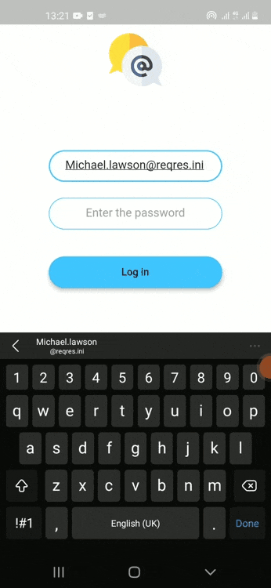

# socil

A new Flutter application.

install :

 i) Link to the apk of the app

 https://drive.google.com/file/d/1X45U7P-y9Vad0suoS0r_yp4D2ohld-zk/view?usp=sharing

 ii)clone git to android studio with flutter

Screen

1) Login screen

 - user can log in to the app via reqres api

 - the folowing is example of saple user from reqres.ini

          {
              "id": 7,
              "email": "michael.lawson@reqres.in",
              "first_name": "Michael",
              "last_name": "Lawson",
              "avatar": "https://reqres.in/img/faces/7-image.jpg"
          },
          {
              "id": 8,
              "email": "lindsay.ferguson@reqres.in",
              "first_name": "Lindsay",
              "last_name": "Ferguson",
              "avatar": "https://reqres.in/img/faces/8-image.jpg"
          },
          {
              "id": 9,
              "email": "tobias.funke@reqres.in",
              "first_name": "Tobias",
              "last_name": "Funke",
              "avatar": "https://reqres.in/img/faces/9-image.jpg"
          },
          {
              "id": 10,
              "email": "byron.fields@reqres.in",
              "first_name": "Byron",
              "last_name": "Fields",
              "avatar": "https://reqres.in/img/faces/10-image.jpg"
          },
          {
              "id": 11,
              "email": "george.edwards@reqres.in",
              "first_name": "George",
              "last_name": "Edwards",
              "avatar": "https://reqres.in/img/faces/11-image.jpg"
          }

    -if user did not logout , the app will login user automatic when app is restarted

    2) chat screen
    dum post will be show from https://dummyapi.io/

   

    3)comment screen
    dum comment will be shown of the certain post

    NOTE: some post have no comment posted from them from https://dummyapi.io/
    
